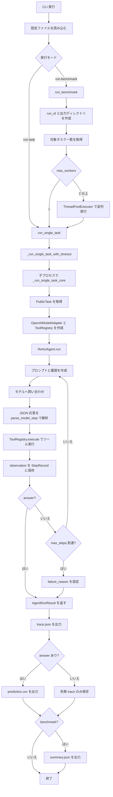

# agents コード概要

`src/data_agent_baseline/agents/` は、ReAct 形式でモデルにツールを使わせ、最終回答を作るための実行基盤です。v2 では素の逐次 ReAct に加えて、`profile_context`、`plan_knowledge`、`retrieve_context`、`execute_data_query`、`validate_answer` を標準ツール化し、context scan、knowledge 全文参照、文書検索、横断クエリ、回答検査を明示的な手順として扱います。

## 全体フロー

1. `runner.py` が `OpenAIModelAdapter`、`ToolRegistry`、`ReActAgent` を組み立てる。
2. `ReActAgent.run()` がタスクごとに実行状態を初期化する。
3. `_build_messages()` が system prompt、難易度別 strategy、v2 tool workflow を含む task prompt、過去ステップの observation を会話履歴に変換する。
4. `ModelAdapter.complete()` でモデルから次の行動を受け取る。
5. `parse_model_step()` がモデル応答から `thought`, `action`, `action_input` を取り出す。
6. `ToolRegistry.execute()` が指定ツールを実行し、結果を observation として保存する。
7. 通常は `profile_context -> plan_knowledge -> retrieve/query -> validate_answer -> answer` の順に進む。
8. `answer` ツールが呼ばれるか、`max_steps` に到達するまで繰り返す。

## 現在の処理フロー



### 単一タスク実行

`uv run dabench run-task ...` などから単一タスクを実行する場合の流れです。

1. CLI が設定ファイルを読み込み、`run_single_task()` を呼び出す。
2. 通常実行では `_run_single_task_with_timeout()` が子プロセスを起動し、タスク単位のタイムアウトを管理する。
3. 子プロセス内で `_run_single_task_core()` が `DABenchPublicDataset` を作り、`task_id` に対応する `PublicTask` を取得する。
4. `OpenAIModelAdapter` と標準 `ToolRegistry` を作り、`ReActAgent` に渡す。
5. `ReActAgent.run()` がモデル応答とツール実行を繰り返し、`AgentRunResult` を返す。
6. 親プロセスが結果を受け取り、`e2e_elapsed_seconds` を追加する。
7. `_write_task_outputs()` が `trace.json` を出力し、回答がある場合は `prediction.csv` も出力する。

出力先は `artifacts/runs/<run_id>/<task_id>/` です。回答が生成されなかった場合でも、失敗理由を含む `trace.json` は出力されます。

### ベンチマーク実行

`uv run dabench run-benchmark ...` の場合は、複数タスクをまとめて処理します。

1. `run_benchmark()` が `run_id` を決め、実行ディレクトリを作る。
2. `DABenchPublicDataset.iter_tasks()` で対象タスク一覧を取得する。
3. `--limit N` が指定されていれば、先頭 N 件に絞る。
4. `run.max_workers` が 1 の場合は順番に `run_single_task()` を呼び出す。
5. `run.max_workers` が 2 以上の場合は `ThreadPoolExecutor` でタスクを並列実行する。
6. 各タスクの出力は単一タスク実行と同じ形式で保存する。
7. 最後に `summary.json` を作り、成功数、タスク数、各タスクの出力パスを記録する。

テスト用に `model` または `tools` を外から渡した場合は、共有インスタンスを使うため並列数は 1 に固定されます。

### ReAct ループ内部

`ReActAgent.run()` の 1 ステップは次の順序で進みます。

1. `build_system_prompt()` で基本ルール、ツール説明、応答例をまとめる。
2. `build_task_prompt()` で質問文を user message にする。
3. 過去ステップがあれば、モデルの生応答と observation を履歴に追加する。
4. `model.complete()` で次のモデル応答を取得する。
5. `parse_model_step()` で JSON fenced block を読み取り、`action` と `action_input` を得る。
6. `tools.execute()` で該当ツールを実行する。
7. ツール結果を observation として `StepRecord` に保存する。
8. `answer` ツールなら `state.answer` をセットして終了する。
9. 例外が出た場合は `__error__` ステップとして記録し、次のステップに進む。

`max_steps` 以内に `answer` が呼ばれなかった場合は、`failure_reason` に `"Agent did not submit an answer within max_steps."` が入ります。

### v2 の solver 方針

v2 は agent loop 自体を大きく分岐させず、モデルに公開するツールと prompt で solver 方針を固定します。

- Easy: `profile_context` と `plan_knowledge` の後、CSV/JSON を `execute_python` または `execute_data_query` で処理する。
- Medium: `profile_context` と `plan_knowledge` の後、SQLite schema と CSV/JSON schema を見て、DB 単体は `execute_context_sql`、横断 join は `execute_data_query` を使う。
- Hard/Extreme: `plan_knowledge` で `knowledge.md` 全文を確認し、`retrieve_context` で `doc/*.md` から関連 chunk を集めてから、構造データの query と計算に進む。

各難易度で、質問理解、必要カラム・filter・join key・集計条件の確認、実データ preview、key 値や表記揺れの確認、計算、検証の順に進めます。DB も schema だけでなく `inspect_sqlite_schema` の preview rows や小さな `execute_context_sql` で実値を確認します。0 件・0 値が出た場合は、表記、case、空白、日付形式、null、code 定義を疑ってから採用します。回答値は元データの列を保ち、明示要求がない限り first/last name などを結合して新しい値を作りません。

`knowledge.md` は `context/knowledge.md` 直下を標準として扱います。`profile_context` は `context/knowledge.md` を除外し、`plan_knowledge` が参照データ profile とあわせて `knowledge.md` 全文を返します。

## ファイル別の役割

### `model.py`

モデル呼び出しの抽象化を担当します。

- `ModelMessage`: モデルに渡す会話メッセージ。
- `ModelStep`: モデル応答をパースした 1 ステップ分の行動。
- `ModelAdapter`: `complete()` を持つモデルアダプタの Protocol。
- `OpenAIModelAdapter`: OpenAI 互換 Chat Completions API を呼び出す実装。
- `ScriptedModelAdapter`: 固定レスポンスを順に返すテスト・検証用アダプタ。

`OpenAIModelAdapter` は `config.agent` の `model`, `api_base`, `api_key`, `temperature`, `request_timeout_seconds`, `max_retries` を使います。API キーが空の場合やレスポンス本文が無い場合は `RuntimeError` を送出します。

### `prompt.py`

モデルに渡すプロンプト文字列を生成します。

- `REACT_SYSTEM_PROMPT`: ReAct エージェントの基本ルール。
- `RESPONSE_EXAMPLES`: JSON fenced block の応答例。
- `build_system_prompt()`: 基本ルール、ツール説明、応答例を結合する。
- `build_task_prompt()`: タスクの質問文、context 構成、難易度別 strategy、パス指定ルールを作る。
- `build_observation_prompt()`: ツール実行結果を JSON 形式の observation として渡す。

モデル応答は、単一の JSON オブジェクトを ```json fenced block に入れる前提です。

### `react.py`

ReAct の実行ループを担当する中心モジュールです。

- `ReActAgentConfig`: 最大ステップ数などの実行設定。
- `_strip_json_fence()`: fenced block から JSON 本体を取り出す。
- `_load_single_json_object()`: 応答が単一 JSON オブジェクトだけであることを確認する。
- `parse_model_step()`: モデル応答を `ModelStep` に変換する。
- `ReActAgent`: モデル呼び出し、ツール実行、履歴更新、終了判定を行う。

ツール実行やパースで例外が起きた場合も、ステップは `__error__` として記録されます。その後も `max_steps` までは継続します。

### `runtime.py`

実行中および実行後の状態を表すデータクラスを定義します。

- `StepRecord`: 1 ステップ分の thought、action、入力、モデル生応答、observation、成否。
- `AgentRuntimeState`: 実行中のステップ履歴、回答、失敗理由。
- `AgentRunResult`: 実行結果。`succeeded` で成功判定し、`to_dict()` で trace 用の辞書に変換する。

### `__init__.py`

`agents` パッケージ外から使う主要クラス・関数を再エクスポートします。

## 標準ツール

`tools/registry.py` でモデルに公開する tool を登録します。

- `list_context`: `context/` 配下のファイル一覧を取得する。
- `profile_context`: task の難易度、質問、存在ファイル、modality、CSV header/row count、JSON shape、SQLite schema、文書見出しをまとめて返す。`context/knowledge.md` は除外する。
- `plan_knowledge`: `profile_context` 後に、参照データ profile と `knowledge.md` 全文を返し、用語、閾値、ルール確認に使う。
- `retrieve_context`: `knowledge.md` と `doc/*.md` から、質問・キーワードに関連する chunk を返す。
- `read_csv`, `read_json`, `read_doc`: CSV/JSON/テキストのプレビューを取得する。
- `inspect_sqlite_schema`, `execute_context_sql`: SQLite schema、row count、preview rows 確認と読み取り SQL 実行を行う。
- `execute_data_query`: CSV/JSON/SQLite を DuckDB 上に登録し、横断 SQL で join・集計・ranking を行う。JSON は `records` wrapper を table 化し、単一 table の SQLite は table 名で参照できる view も作る。
- `execute_python`: `context/` 配下を working directory として Python を実行する。
- `validate_answer`: 最終回答前に shape error、空回答、0 値、余分列、tie、複数行取りこぼし、数値表記、結合名らしさ、根拠不足のリスクを確認する。
- `answer`: 最終回答 table を提出して task を終了する。

## 主要な入出力

- 入力: `PublicTask`
- モデル入力: `list[ModelMessage]`
- モデル出力: JSON fenced block の文字列
- ツール入力: `action`, `action_input`
- ツール出力: observation 辞書
- 最終結果: `AgentRunResult`

## 拡張時の注意点

- 新しいモデル実装を追加する場合は `ModelAdapter.complete()` に合わせる。
- プロンプト形式を変える場合は `parse_model_step()` の期待形式も確認する。
- 新しいツールを追加する場合は `tools/registry.py` に `ToolSpec` と handler を登録する。
- `answer` が呼ばれない場合、結果は失敗扱いになり `failure_reason` が入る。
- trace に残したい情報は `StepRecord` または observation に含める。
